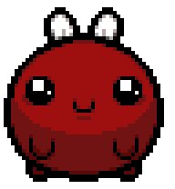

<div align="center">

# 糖梅宝宝 · Codex 桌宠

一只使用游戏原版像素素材重建、会在桌面上原地飞行，也会在你把鼠标移到它身上时挥手的糖梅宝宝。




<p><strong>鼠标悬停，糖梅宝宝挥手：</strong></p>


</div>

## ✨ 特点

- 使用 Wiki 公布的原版透明像素素材，不经过视频抠图
- 按照原版 `30 FPS / 16 帧` 待机参数原地飞行
- 保留连续的暗红阴影和黑色像素轮廓
- 无半透明毛边、显示器扫描条纹或灰色背景残留
- 鼠标移到桌宠身上时，播放由 Wiki 原版姿势组成的挥手动作；移开后恢复飞行待机
- 单击仍由 Codex 处理，会打开主界面，不会触发挥手
- 不跟随鼠标方向，平时保持安静的原地飞行
- 符合 Codex `spriteVersionNumber: 2` 桌宠格式

## 📦 安装

1. 下载仓库中的 `pet.json` 和 `spritesheet.png`。
2. 创建以下文件夹：

   ```text
   %USERPROFILE%\.codex\pets\video-red-pet\
   ```

3. 将两个文件放入该文件夹，目录结构应为：

   ```text
   video-red-pet/
   ├── pet.json
   └── spritesheet.png
   ```

4. 打开 Codex 的桌宠设置，选择「糖梅宝宝」。

如果仍显示旧版本，请重新选择一次桌宠或重启 Codex，以刷新精灵图缓存。

## 🎞️ 动画规格

| 项目 | 数值 |
| --- | --- |
| 精灵格式 | Codex v2 |
| 单格尺寸 | `192 × 208` |
| 图集尺寸 | `1536 × 2288` |
| 待机帧数 | 16 帧 |
| 帧率 | 30 FPS |
| 循环时长 | 约 0.53 秒 |
| 悬停互动 | 5 帧挥手，单段约 0.84 秒；播放次数由 Codex 控制 |
| 缩放方式 | Nearest-neighbor 像素缩放 |

## 🗂️ 文件说明

| 文件 | 说明 |
| --- | --- |
| `pet.json` | 桌宠名称、描述和 Codex v2 配置 |
| `spritesheet.png` | 带透明通道的 8×11 动画图集 |
| `assets/preview.webp` | README 中使用的动画预览 |
| `assets/wave-preview.webp` | 悬停挥手互动预览 |
| `LICENSE` | 项目原创配置与文档的 MIT License |
| `THIRD_PARTY_NOTICES.md` | 第三方游戏美术素材声明 |

## 🔗 素材来源

角色原始精灵和待机动画参数参考自[以撒的结合中文 Wiki：糖梅溜溜笛](https://isaac.huijiwiki.com/wiki/C650)。本项目仅将其整理为 Codex 桌宠格式。

## 📄 许可

本项目原创的配置、说明文档及支持代码使用 [MIT License](LICENSE)。

糖梅宝宝角色与游戏美术素材来源于 *The Binding of Isaac: Repentance*，不包含在本项目的 MIT 授权范围内；详情请阅读 [THIRD_PARTY_NOTICES.md](THIRD_PARTY_NOTICES.md)。
